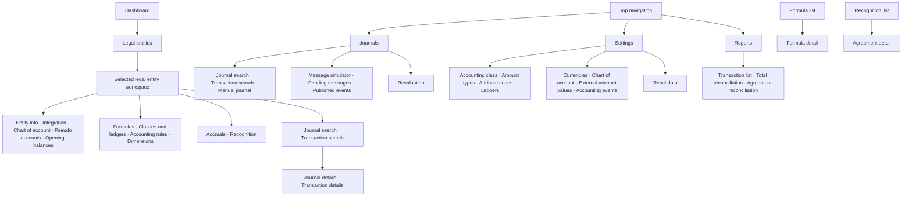

# Accounting Demo App

The App is a React + Vite + TypeScript demo. Local development and Docker use the Node host;
the IIS deployment package uses a self-contained ASP.NET Core 8 out-of-process host, so the server
does not need Node.js or an installed .NET runtime.
Both hosts serve the same UI and same-origin state endpoint within this App project.

## Technology

- **UI:** React 19, TypeScript, and Vite; the deployable UI is a static single-page app.
- **Local development and Docker host:** Node.js 24+, Express 5, and the `mssql` SQL Server
  driver.
- **IIS deployment host:** C# and ASP.NET Core 8, published self-contained and out-of-process
  behind IIS's ASP.NET Core Module. IIS serves the app under its `No Managed Code` pool.
- **Persistence:** Microsoft SQL Server stores each `AppData` collection in typed tables, with
  child tables for journal lines, schedules, dimension selections, and other repeated values.
  SQL Server 2017+ is required for the versioned migration and JSON procedures.

## Source layout

- `src/` — React UI, shared types, and seed/reference data.
- `src/business/` — event booking, accrual, recognition, and revaluation behavior.
- `src/data/` — demo-state client and reference data.
- `server/` — Node host for local development and Docker.
- `Host/` — ASP.NET Core host used by the IIS package.

The hosts serve `dist/` and keep the existing `AppData` request shape while mapping it to relational
SQL tables. The app is intended for one demo user at a time. All persisted state now lives in typed
tables; the full-state JSON snapshot has been removed from the database.

## Database structure

Migration 003 removed the `Demo` prefix from SQL table names without moving or recreating rows.
Migration 004 validated the relational state, disabled snapshot writes, and removed the old snapshot
table. The 40 `AppData` collections are stored in the tables below; repeated values live in child
tables. `StoreMetadata` and `SchemaMigrations` track store initialization and applied versions.

```mermaid
erDiagram
  Currency ||--o{ LegalEntity : base_currency
  Party ||--o{ OrganizationUnit : party
  EventCategory ||--o{ AccountingEvent : groups
  AccountingEvent ||--o{ PendingMessage : triggers
  LegalEntity ||--o{ LegalEntityPartySnapshot : party_roles
  LegalEntity ||--o{ LegalAccountingClass : enables
  AccountingClass ||--o{ LegalAccountingClass : assigned
  LegalAccountingClass ||--o{ LegalAccountingLedger : enables
  Ledger ||--o{ LegalAccountingLedger : assigned
  LegalAccountingLedger ||--o{ AccountingRule : configures
  Formula ||--o{ FormulaAppliesToEvent : applies_to
  Formula ||--o{ FormulaCondition : evaluates
  FormulaCondition ||--o{ Condition : contains
  ChartOfAccount ||--o{ CoaNode : template_nodes
  LegalEntity ||--o{ EntityCoaNode : copied_nodes
  ExtAccountValue ||--o{ ExtAccountPart : defines
  LegalEntity ||--o{ PseudoAccount : configures
  PseudoAccount ||--o{ PseudoAccountSummaryKeepPart : keeps
  PseudoAccount ||--o{ PseudoAccountCoaLink : maps
  PseudoAccount ||--o{ PseudoAccountExtPart : selects
  LegalEntity ||--o{ Integration : configures
  Integration ||--o{ IntegrationDefaultKeepPart : selects
  LegalEntity ||--o{ AccrualItem : accrues
  AccrualCode ||--o{ AccrualItem : classifies
  AccrualItem ||--o{ AccrualConditionInput : carries
  AccrualItem ||--o{ AccrualAccountValue : carries
  AccrualItem ||--o{ AccrualScheduleLine : schedules
  LegalEntity ||--o{ RecognitionPlan : recognizes
  RecognitionCategory ||--o{ RecognitionPlan : classifies
  RecognitionPlan ||--|{ RecognitionPlanLine : contains
  RecognitionPlanLine ||--o{ RecognitionSchedule : schedules
  RecognitionPlanLine ||--o{ ImportedRecognitionSchedule : imports
  LegalEntity ||--o{ Journal : posts
  Journal ||--|{ JournalLine : contains
  Journal ||--o{ JournalPostedEvent : records
  JournalPostedEvent ||--o{ JournalEventAgreementLine : has
  JournalPostedEvent ||--o{ JournalEventInvoice : has
  JournalPostedEvent ||--o{ JournalEventReference : has
  PendingMessage ||--o{ PendingMessageConditionInput : carries
  PendingMessage ||--o{ PendingMessageAmount : carries
  PendingMessage ||--o{ PendingMessageAccountValue : carries
  LegalEntity ||--o{ RevalueAccount : revalues
  RevalueAccount ||--o{ RevalueTransaction : includes
  LegalEntity ||--o{ OpeningBalance : opens
  LegalEntity ||--o{ ExportBatch : exports
  ExportBatch ||--o{ ExportBatchJournal : includes
  ExportBatch ||--o{ ExportBatchLine : exports
```

The diagram shows the logical relationships used by the app. Child ownership is enforced with SQL
foreign keys; some links to shared codebooks and legal entities are represented by their existing
IDs in the stored data rather than new constraints.

| Table group | Tables |
|---|---|
| Shared codebooks | `Currency`, `Party`, `OrganizationUnit`, `AccountingClass`, `Ledger`, `AmountType`, `ConditionValue`, `ConditionValueOption`, `EventCategory`, `AccountingEvent`, `Formula`, `FormulaAppliesToEvent`, `FormulaCondition`, `Condition`, `ChartOfAccount`, `CoaNode` |
| Entity setup | `LegalEntity`, `LegalEntityPartySnapshot`, `LegalAccountingClass`, `LegalAccountingLedger`, `AccountingRule`, `PseudoAccount`, `PseudoAccountSummaryKeepPart`, `ExtAccountValue`, `ExtAccountPart`, `PseudoAccountExtPart`, `PseudoAccountCoaLink`, `EntityCoaNode`, `Integration`, `IntegrationDefaultKeepPart`, `LedgerSeries`, `AccrualCode`, `RecognitionCategory` |
| Accounting activity | `Journal`, `JournalLine`, `JournalPostedEvent`, `JournalEventAgreementLine`, `JournalEventInvoice`, `JournalEventReference`, `PendingMessage`, `PendingMessageConditionInput`, `PendingMessageAmount`, `PendingMessageAccountValue`, `AccrualItem`, `AccrualConditionInput`, `AccrualAccountValue`, `AccrualScheduleLine`, `RecognitionPlan`, `RecognitionPlanLine`, `RecognitionSchedule`, `ImportedRecognitionSchedule`, `RecognitionState`, `RevalueAccount`, `RevalueTransaction`, `ExportBatch`, `ExportBatchJournal`, `ExportBatchLine`, `OpeningBalance` |

## UI navigation and forms

The app uses a top navigation for the four main areas. Entity setup opens a selected legal entity's
workspace; the entity tabs preserve the selected subpage. Journals, Settings, and Reports each have
their own side menu. Search/details and formula/agreement links drill into child views.

This is the routed screen map from `App.tsx`; edit dialogs and inline editors stay within their
own screen instead of having separate routes.

## Run the full demo

From this folder, run `docker compose up --build` and open
[http://localhost:5173](http://localhost:5173). Docker starts SQL Server 2022 and the App.
The App creates the `AccountingDemo` database and applies the relational schema if needed.

## Develop locally

Use Node.js 24+, npm, and Docker Desktop or SQL Server 2022. With `DB_AUTO_CREATE` enabled (the
default), the Node host creates the database and applies the versioned relational schema and SQL
procedures. A pre-provisioned database must have the migration applied first.

1. Copy `.env.example` to `.env` and set the database host, port, name, user, and password.
   For the included SQL container, use host `localhost`, port `14333`, and the compose demo
   password.
2. Start the included database with `docker compose up -d sql`, unless using another SQL Server.
3. Run `npm ci` once, then `npm run dev`. This starts Vite and the Node host together.
4. Open [http://localhost:5173](http://localhost:5173).

Run `npm run build` to create the production UI. `npm start` serves that build and requires the
same database environment variables.

## IIS deployment package

The hosted app is at
[https://azs-pfwdev-02.credit-dev.com/DEMO_Accounting](https://azs-pfwdev-02.credit-dev.com/DEMO_Accounting).
It uses SQL Server at `AZS-PFSDEV-07.credit-dev.com`, database `DEMO_Accounting` (TCP port 1433).
The web host and database are on different servers. The user verified that app changes are stored
in the SQL database.

The package and database scripts are in the repository's root `Deploy/` folder.
`DEMO_Accounting.sql` creates the `DEMO_Accounting` database and applies the initial migrations.
Run it from the repository root in SQLCMD mode for a fresh database. For an existing database,
apply pending numbered migration scripts in order. Migration 003 removes the table-name prefix;
migration 004 verifies all 40 collections can be read, disables snapshot writes, and removes the
rollback snapshot. Node applies 004 after the store has initialized; on IIS, run it after the first
successful app load/save. Both numbered scripts are safe to rerun. After migration 003, use numbered
upgrade scripts instead of rerunning the initial bootstrap script. The ZIP contains the built UI,
ASP.NET Core 8 host, IIS `web.config`, and target SQL connection settings; extract it to the IIS
application's physical folder.

The IIS application pool is `DEMO_Accounting` and can remain `No Managed Code`. The package runs
out-of-process through IIS's ASP.NET Core Module. That module must already be installed; the package
does not need a .NET runtime, Node.js, URL Rewrite, or ARR. The SQL migration runs separately before
the IIS app starts. Migration 004 removes the snapshot after initialization and the rollback window;
the IIS host keeps calling the same relational load/save procedures. The ZIP contains credentials
and is ignored by Git; treat it as a secret. The supplied SQL login currently has `sysadmin` rights,
so replace it with an app-only login before exposing the demo beyond its trusted internal audience.

## Data and reset

Seed data and illustrative examples live under `src/data/`. The original SQL snapshot was imported
into relational tables and removed after save/reload verification. Writes now update only the
relational tables. The **Settings → Reset data** page restores seeded defaults and saves them to SQL
Server.

The app saves its full state after edits in one SQL transaction. A status indicator shows whether
the latest save completed. If SQL Server is unavailable, the host still serves the UI and the app shows a friendly
connection message with retry. Expand **Technical details for support or AI** to copy the browser
and server diagnostic report; database passwords are redacted. Unexpected React startup errors
use the same friendly report. The IIS package also maps common ASP.NET Core process-start failures
to a static friendly page with copyable time, URL, and browser details; include the matching
ASP.NET Core Module event from Windows Application logs for the server exception.

## Main workflows

- Dashboard and legal entity setup.
- Chart of accounts, dimensions, pseudo accounts, formulas, and accounting rules.
- Accounting-event simulator, accruals, recognition, and revaluation.
- Manual journals, journal and transaction searches, pending messages, and posted events.
- GL integrations and export configuration, reports, and reset-to-seed settings.

## Repository guide

- [AI working rules](AGENTS.md)
- [Current work and decision log](DEMO_DEPLOYMENT.md)
- [Archived service, contracts, and reference material](Documents/)
